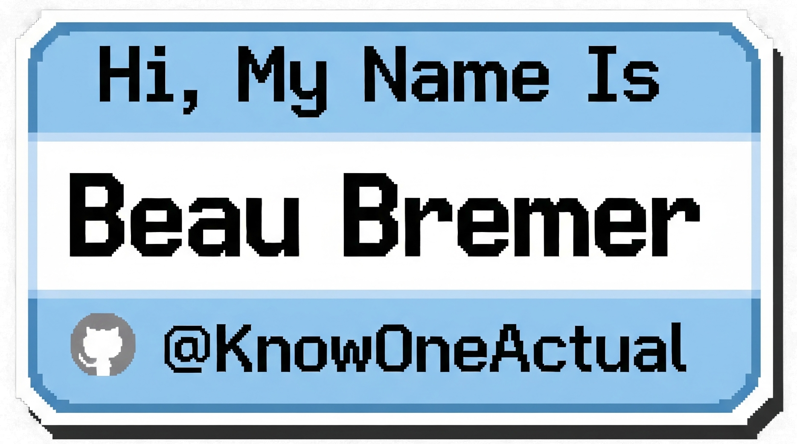

  

I'm a tech generalist with a deep-seated passion for ensuring systems run smoothly and efficiently. With a background spanning IT operations, audio-visual technical services, and project management, I bring a highly analytical and solution-oriented approach to complex challenges.

⚡ Fun fact: When I'm not troubleshooting networks, I'm usually hunting for new music or starting my journey into learning how to create it.

This GitHub profile is where I explore my interests in code, build practical tools, and document my learning journey, often sharing insights and lessons learned on [My Blog](https://blog.beaubremer.com/).

-----

### Skills & Technologies

* **Languages:** Python, JavaScript
* **Tools & Platforms:** Wireshark, Eleventy, Chart.js, Git
* **APIs:** Google Gemini API, OpenWeatherMap API, MindMax API, IP API
* **Core Concepts:** Network Troubleshooting, Automation & Scripting, Web Security (CSP), Data Visualization, IT Operations

-----

### Projects

Here are a few highlights of what you'll find in my repositories. This is a living project where I experiment with new technologies and show my work.

* **[Conversational Weather Bot](https://beaubremer.com/weather):** An interactive chatbot built with JavaScript that integrates with Google's Gemini API for natural language processing and the OpenWeatherMap API for live weather data.
* **[AV IP Subnet Calculator](https://beaubremer.com/ip_subnet_calculator):** A fast IP subnet calculator designed for AV technicians to plan on-site networks by mapping specific gear to IP addresses.
* **Network Latency Monitor:** A client-side tool to monitor the availability and latency of network endpoints in real-time.
* **[Eleventy Blog with a Security-First Approach](https://blog.beaubremer.com):** I built my personal blog using the static site generator Eleventy. I took a security-first approach, implementing a strong Content Security Policy (CSP) and other security headers to harden it against modern web vulnerabilities. I also focused on performance by adding features like automatic image optimization.
* **[Data Visualization Insights](https://www.google.com/search?q=https://beaubremer.com/trends.html):** An interactive infographic project that showcases industry trends and market research, demonstrating effective data presentation using Chart.js.

### What I'm Focused On

I'm always learning and expanding my skillset. Currently, I'm actively expanding my capabilities in:

  * **Network Troubleshooting:** Using tools like Wireshark for deep packet analysis.
  * **Automation:** Leveraging Python for scripting to enhance operational efficiency.
  * **Writing:** Sharing my experiences and what I'm learning on my blog.

-----

### Let's Connect

I'm always open to hearing about ways I can improve.

  * **Main Site:** [beaubremer.com](https://beaubremer.com)
  * **Blog:** [blog.beaubremer.com](https://blog.beaubremer.com)
  * **EaaS | Ego as a Service:** [ProfitandEgo.com](https://profitandego.com)
  * **The Tuesday Firm:** [Tuesdayfirm.dev](https://tuesdayfirm.dev)
  * **RGBsquared Media Group:** [RGBsquared.com](https://rgbsquared.com)
  * **GrimBurly.xyz:** [GrimBurly.xyz](https://GrimBurly.xyz)
  * **Privacy Version of the Main Site:** [Tor Browser via this link](http://32fd3d4gq3u4qqpofstaiq3sf3h6tnyrdpqdcgdszbrhovv25yfxzhqd.onion) *Only viewable via The Tor Browser
