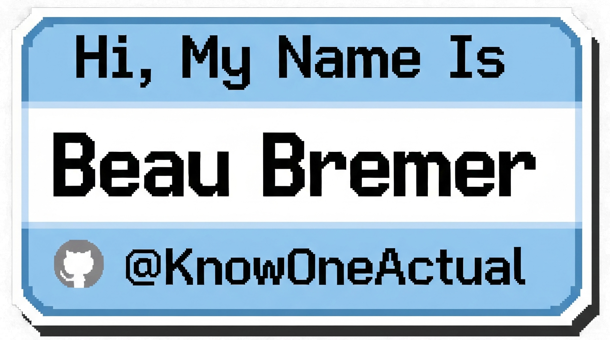

  
  
  # Hi, I'm Beau.
  
  **AV/IT Project Lead & Python Developer**
  
  <a href="https://beaubremer.com">Website</a> • <a href="https://blog.beaubremer.com">Blog</a> • <a href="https://bsky.app/profile/grimburly.xyz">Bluesky</a>

  

---

### About Me

I spent over a decade managing complex audiovisual systems and IT operations in Chicago. Now, I use that experience to write code that solves the headaches I used to deal with manually.

I specialize in **Python automation** and **network troubleshooting**. If a task is repetitive or a system is broken, I usually write a script to fix it.

⚡ **Fun fact:** When I'm not analyzing packets in Wireshark, I'm usually hunting for obscure music or learning how to produce it.

---

### 🛠️ The Toolbox

**Languages**
  

**Core Tech**
   

---

### 🔭 Featured Repositories

I build tools to streamline workflows and diagnose network issues.

#### 🖥️ System & Workflow Automation
* **[macos-dev-launcher](https://github.com/KnowOneActual/macos-dev-launcher):** A macOS Quick Action I wrote to speed up my daily startup routine.
* **[Project_Starter_Script](https://github.com/KnowOneActual/Project_Starter_Script):** A Bash script to instantly scaffold new GitHub projects with my preferred boilerplate.
* **[python-venv-manager](https://github.com/KnowOneActual/python-venv-manager):** A simple CLI tool to create and manage Python virtual environments without the usual friction.

#### 📡 Network & Utilities
* **[Network-Triage-Tool](https://github.com/KnowOneActual/Network-Triage-Tool):** A standalone GUI app for network pros to quickly diagnose connection issues on the fly.
* **[py_network_port_scan](https://github.com/KnowOneActual/py_network_port_scan):** A multi-threaded TCP port scanner for checking endpoint availability.
* **[wireshark-profiles](https://github.com/KnowOneActual/wireshark-profiles):** A guide and config set for backing up Wireshark profiles using Git—essential for AV/IT techs moving between sites.

---

### 📝 Latest from the Blog

I document what I learn so I don't have to Google it twice.

* Check out my **[Security-First Eleventy Blog](https://blog.beaubremer.com)** where I write about implementing Content Security Policies (CSP) and image optimization.

   
  

-----

### 🌐 Where to Find Me

| **Ventures & Projects** | **Socials** |
| :--- | :--- |
| 🏢 **[RGBsquared Media Group](https://rgbsquared.com)** (AV/IT Services) | 🦋 **[Bluesky](https://bsky.app/profile/grimburly.xyz)** |
| 💻 **[The Tuesday Firm](https://tuesdayfirm.dev)** (Dev Projects) | 🐘 **[Mastodon](https://defcon.social/@GrimBurly)** |
| 🕶️ **[ProfitandEgo.com](https://profitandego.com)** (EaaS and Comedy) | 🔒 **[Tor/Onion Site](http://32fd3d4gq3u4qqpofstaiq3sf3h6tnyrdpqdcgdszbrhovv25yfxzhqd.onion)** |
| >_ **[GrimBurly.xyz](https://grimburly.xyz)** (Social Site) | 
