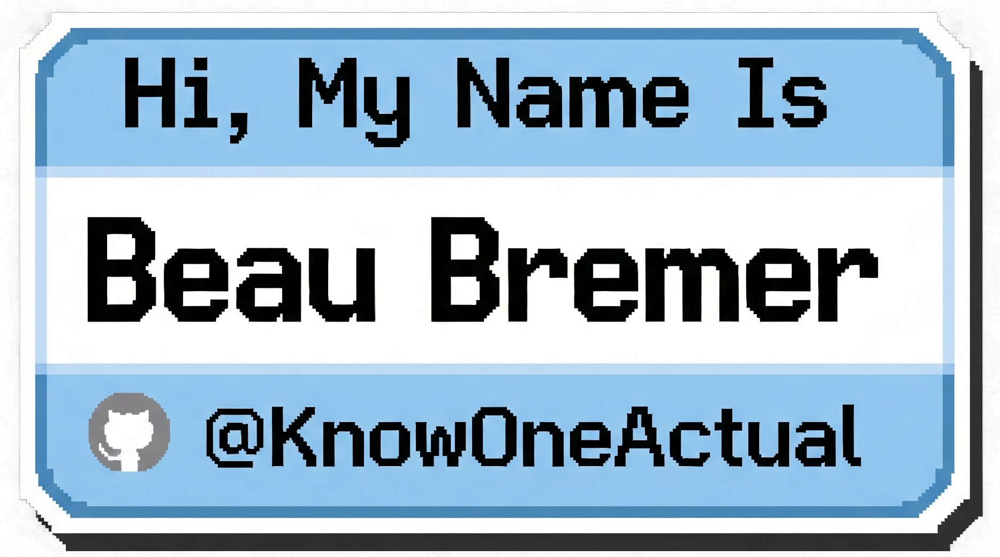
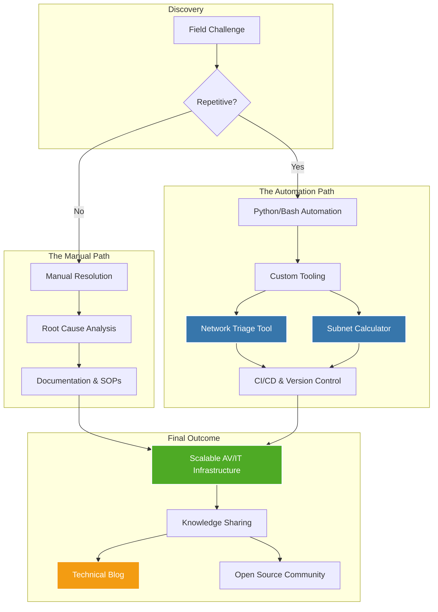

  

  # Hi, I'm Beau.
  
  **AV/IT Project Lead & Python enthusiast.**  
  I build tools to make the complex repeatable and the boring automated.

  [Personal Site](https://beaubremer.com) • [Blog](https://blog.beaubremer.com) • [Bluesky](https://bsky.app/profile/grimburly.xyz)

---

### ☕ About Me
I've spent well over a decade managing complex AV systems and IT operations in Chicago. I started automating things because I believe that if you have to do it twice, it should probably be a script. 

I specialize in **Python automation**, **network triage**, and **custom tooling** for live environments. When I'm not staring at a terminal, I'm usually hunting for obscure music or experimenting with sound production.

**Currently focused on:** GPU-accelerated video transcoding and Docker for live AV.

---

### 🛠️ The Toolkit
*Clean, functional, and mostly open-source.*

**Core:**      
**AV/Video:** CasparCG • vMix • Linux Show Player • FFmpeg  
**OS:** Fedora (Workstation) • macOS (Production) • Linux (Servers)

---

### 🚀 Projects & Tools
*A mix of field-tested utilities and learning experiments.*

#### 🏆 Featured Project: [Network Triage Tool](https://github.com/KnowOneActual/Network-Triage-Tool)
**The "Swiss Army Knife" for AV/IT Field Techs.**

| **The Problem** | **The Solution** | **Tech Stack** |
| :--- | :--- | :--- |
| Disconnected tools (Nmap, Speedtest, Subnetting) slow down onsite triage. | A high-performance TUI that centralizes diagnostics into a single dashboard. | `Python`, `Textual`, `Nmap`, `Speedtest-CLI` |

- ⚡ **Key Feature:** Live dashboard for real-time endpoint monitoring.
- 🛠️ **Impact:** Streamlines troubleshooting in high-pressure live event environments.

---

#### 🔧 Other Utilities
- **[Conversational Weather Bot](https://beaubremer.com/weather)** – AI-powered weather assistant using Gemini & OpenWeather.
- **[AV IP Subnet Calculator](https://beaubremer.com/ip_subnet_calculator)** – Tailored for techs wiring sites in the field.
- **[macos-dev-launcher](https://github.com/KnowOneActual/macos-dev-launcher)** – A macOS Quick Action to spin up my dev environment.

---

### 📝 Latest from the Blog
*(Auto-updates from blog.beaubremer.com)*

<!-- BLOG-POST-LIST:START -->
- [Live Streaming Video Software Isn&#39;t the Bottleneck Anymore, Your Workflow Is](https://blog.beaubremer.com/posts/live-streaming-software-isn-t-the-bottleneck-anymore/)
- [Thinking is the Tool: Hacking the Physical World](https://blog.beaubremer.com/posts/thinking-is-the-tool-hacking-the-physical-world/)
- [Why I Built My Own &#39;Link in Bio&#39; Page &lpar;And You Can Too&rpar;](https://blog.beaubremer.com/posts/build-a-link-in-bio-page/)
- [The Git Commands I Actually Use Every Day &lpar;And Why&rpar;](https://blog.beaubremer.com/posts/the-git-commands-i-actually-use-every-day-and-why/)
- [The AV Pro&#39;s Guide to Bulletproof Video Playback](https://blog.beaubremer.com/posts/the-av-pro-guide-to-bulletproof-video-playback/)
<!-- BLOG-POST-LIST:END -->

---
### 📐 How I Solve Problems
*Bridging the gap between physical AV systems and automated IT workflows.*

```mermaid
graph TD
    subgraph Discovery
    A[Field Challenge] --> B{Repetitive?}
    end

    subgraph The Manual Path
    B -- No --> D[Manual Resolution]
    D --> D1[Root Cause Analysis]
    D1 --> D2[Documentation & SOPs]
    end

    subgraph The Automation Path
    B -- Yes --> C[Python/Bash Automation]
    C --> E[Custom Tooling]
    E --> F[Network Triage Tool]
    E --> G[Subnet Calculator]
    F --> F1[CI/CD & Version Control]
    G --> F1
    end

    subgraph Final Outcome
    D2 --> H[Scalable AV/IT Infrastructure]
    F1 --> H
    H --> I[Knowledge Sharing]
    I --> J[Technical Blog]
    I --> K[Open Source Community]
    end

    style F fill:#3776AB,stroke:#fff,stroke-width:2px,color:#fff
    style G fill:#3776AB,stroke:#fff,stroke-width:2px,color:#fff
    style H fill:#4EAA25,stroke:#fff,stroke-width:2px,color:#fff
    style J fill:#f39c12,stroke:#fff,stroke-width:1px,color:#fff
```

---

### 🌐 My Ecosystem
*Where I spend my time online.*

**Ventures:** [RGBsquared Media](https://rgbsquared.com) (Consulting) • [The Tuesday Firm](https://tuesdayfirm.dev) (Dev)  
**Social:** [Bluesky](https://bsky.app/profile/grimburly.xyz) • [Mastodon](https://defcon.social/@GrimBurly)  
**Misc:** [Profit & Ego](https://profitandego.com) (Comedy) • [GrimBurly.xyz](https://grimburly.xyz) (Personal Hub)
