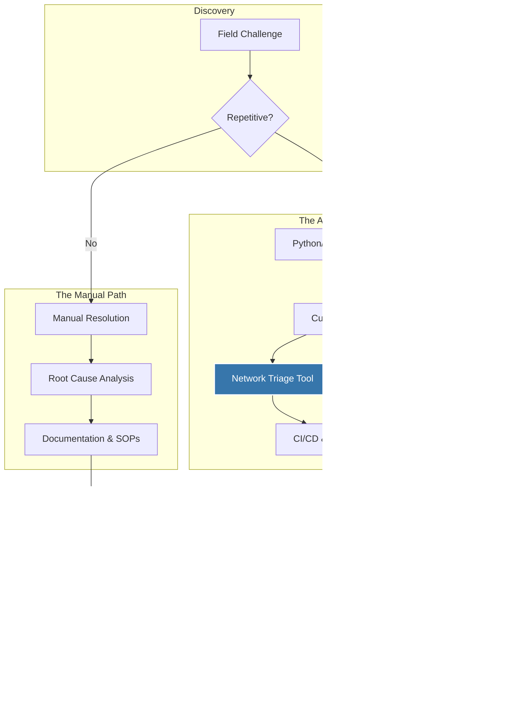

  
  
  **AV/IT Field Engineer & Python Developer**  
  I build automation tools for live event systems and enterprise networks.

  [Personal Site](https://beaubremer.com) • [Blog](https://blog.beaubremer.com) • [Bluesky](https://bsky.app/profile/grimburly.xyz)

  
  

---

### ☕ About Me
I manage AV systems and IT networks in Chicago. I have over fifteen years of field experience. I write Python and Bash scripts to automate my work.

I build custom tools for live events. I deploy network hardware and configure VLANs. I also work with Docker and video files.

Currently, I focus on GPU video transcoding and Docker for live AV.

---

### 🛠️ The Toolkit
*Clean, functional, and mostly open-source.*

**Languages & Scripting:**       
**Tools & Platforms:**      
**AV/Video:** CasparCG • vMix • Linux Show Player • FFmpeg  
**OS:**    Ubuntu • BSD

---

### 🚀 Projects & Tools
*A mix of field-tested utilities and learning experiments.*

#### 🏆 Featured Project: [Network Triage Tool](https://github.com/KnowOneActual/Network-Triage-Tool)
**The "Swiss Army Knife" for AV/IT Field Techs.**

| **The Problem** | **The Solution** | **Tech Stack** |
| :--- | :--- | :--- |
| Disconnected tools (Nmap, Speedtest, Subnetting) slow down onsite triage. | A high-performance TUI that centralizes diagnostics into a single dashboard. | `Python`, `Textual`, `Nmap`, `Speedtest-CLI` |

- ⚡ **Key Feature:** Live dashboard for real-time endpoint monitoring.
- 🛠️ **Impact:** Streamlines troubleshooting in high-pressure live event environments.

---

#### 🔧 Other Utilities

| **Project** | **The Problem & Solution** | **Tech Stack** |
| :--- | :--- | :--- |
| **[Weather Bot](https://beaubremer.com/weather)** | Static forecasts are hard to digest. This AI bot provides natural, conversational weather updates. | `Python`, `Gemini API`, `OpenWeather` |
| **[AV Subnet Calculator](https://beaubremer.com/ip_subnet_calculator)** | Ad-heavy calculators waste time. This is a clean, ad-free IP calculator tailored for field techs. | `JavaScript`, `HTML`, `CSS` |
| **[macos-dev-launcher](https://github.com/KnowOneActual/macos-dev-launcher)** | Launching terminal/IDE/Docker manually wastes time. Spins up the dev environment in one click. | `Bash`, `AppleScript` |

---

### 📝 Latest from the Blog
*(Auto-updates from blog.beaubremer.com)*

<!-- BLOG-POST-LIST:START -->
- [Why Yazi is the Terminal File Manager You Need](https://blog.beaubremer.com/posts/why-yazi-is-the-terminal-file-manager-you-need/)
- [A Cross-Platform Guide to Syncing Obsidian with GitHub](https://blog.beaubremer.com/posts/obsidian-sync-with-github/)
- [Sharing Your Python Tools with the World](https://blog.beaubremer.com/posts/sharing-your-python-tools-with-the-world/)
- [Staying Flexible Without Letting Your Process Get Bulldozed](https://blog.beaubremer.com/posts/staying-flexible-without-letting-your-process-get-bulldozed/)
- [Moving to Local Hardware](https://blog.beaubremer.com/posts/moving-to-local-hardware/)
<!-- BLOG-POST-LIST:END -->

---

### 📐 How I Solve Problems
*Bridging the gap between physical AV systems and automated IT workflows.*

```mermaid
graph TD
    subgraph Discovery
    A[Field Challenge] --> B{Repetitive?}
    end

    subgraph The Manual Path
    B -- No --> D[Manual Resolution]
    D --> D1[Root Cause Analysis]
    D1 --> D2[Documentation & SOPs]
    end

    subgraph The Automation Path
    B -- Yes --> C[Python/Bash Automation]
    C --> E[Custom Tooling]
    E --> F[Network Triage Tool]
    E --> G[Subnet Calculator]
    F --> F1[CI/CD & Version Control]
    G --> F1
    end

    subgraph Final Outcome
    D2 --> H[Scalable AV/IT Infrastructure]
    F1 --> H
    H --> I[Knowledge Sharing]
    I --> J[Technical Blog]
    I --> K[Open Source Community]
    end

    style F fill:#3776AB,stroke:#fff,stroke-width:2px,color:#fff
    style G fill:#3776AB,stroke:#fff,stroke-width:2px,color:#fff
    style H fill:#4EAA25,stroke:#fff,stroke-width:2px,color:#fff
    style J fill:#f39c12,stroke:#fff,stroke-width:1px,color:#fff
```

---

### 🌐 My Ecosystem
*Where I spend my time online.*

**Ventures:** [RGBsquared Media](https://rgbsquared.com) (Consulting) • [The Tuesday Firm](https://tuesdayfirm.dev) (Dev)  
**Social:** [Bluesky](https://bsky.app/profile/grimburly.xyz) • [Mastodon](https://defcon.social/@GrimBurly)  
**Misc:** [Profit & Ego](https://profitandego.com) (Comedy) • [GrimBurly.xyz](https://grimburly.xyz) (Personal Hub)

---

### 📄 License
This repository is open-source and available under the [MIT License](LICENSE).

